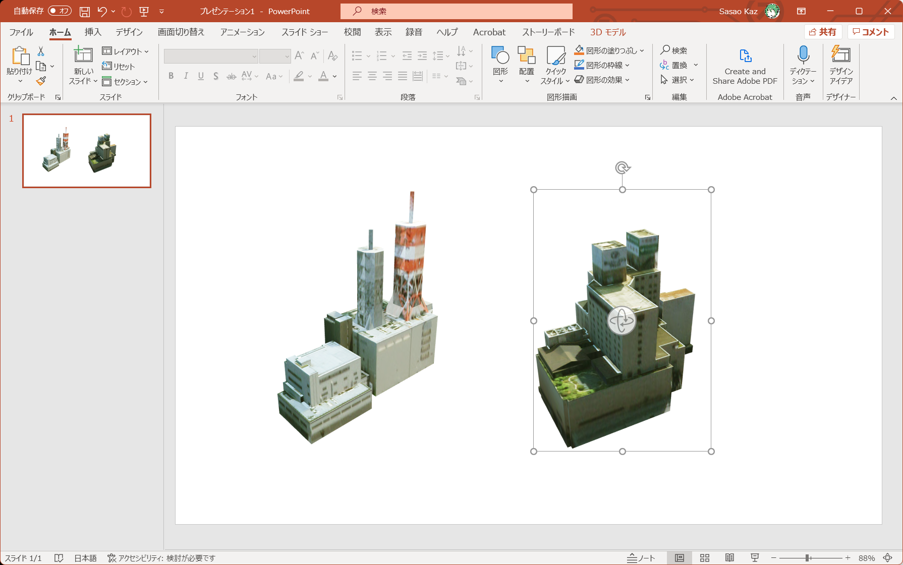
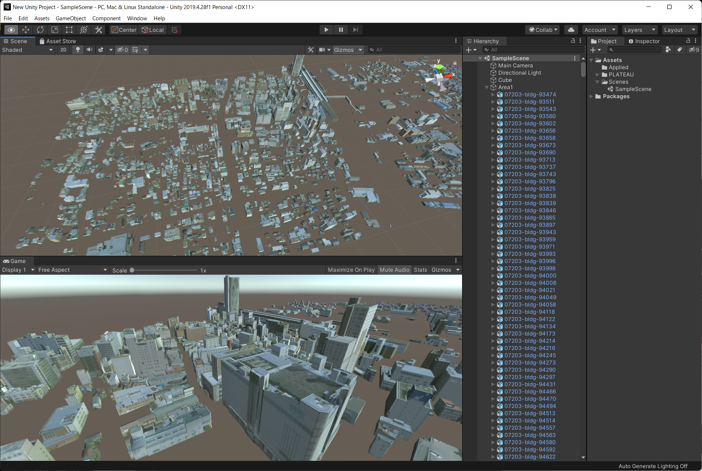

# PlateauCityGml

[Project PLATEAU](https://www.mlit.go.jp/plateau/) の [3D都市モデル](https://www.geospatial.jp/ckan/dataset/plateau)で提供されている CityGML形式 (.gml) を Wavefront OBJ (.obj) 形式に変換するツールです。

G空間情報センターで提供されている .obj, .fbx 形式と比較して以下の特徴があります。

- 建物が1つずつ分かれている
- Microsoft Office 製品 (PowerPoint, Excel) などに Drag & Drop することでテクスチャつきで表示可能
- 変換後の長さの単位は m (メートル)
- 左手系 Y-up (Unityなど) に変換済み




## ダウンロード

- [v0.1](https://github.com/ksasao/PlateauCityGmlSharp/releases/download/v0.1/CityGMLToObj_v0.1.zip) (2021/10/31)
- [v0.2](https://github.com/ksasao/PlateauCityGmlSharp/releases/download/v0.1/CityGMLToObj_v0.2.zip) (2021/12/14)

## 利用方法

```txt
CityGMLToObj .gmlファイルのパス [[基準点となる緯度] [経度] [高度]]
```

### もっとも簡単な使い方

.gml ファイルを CityGMLToObj.exe に Drag&Drop すると、必要なテクスチャを読み込み、CityGMLToObj.exe のあるフォルダ内に output フォルダを作成し、その中に .obj ファイルを生成します。

### コマンドラインでの利用

引数に .gml ファイルを指定すると、CityGMLToObj.exe のあるフォルダ内に output フォルダを作成し、その中に .obj ファイルを生成します。

```txt
CityGMLToObj.exe sample.gml
```

実行すると、1行目に CityGML モデルの原点位置(緯度、経度、高度)を表示するとともに、2行目以降に各モデルの情報を出力します。出力はタブ区切りです。

```txt
Origin: 37.391669674984,140.374857207597,226.125
ID      Latitude        Longitude       Altitude        Triangles       Name
07203-bldg-93690        37.39234125     140.37557878    240.507995605469        6
07203-bldg-93737        37.39213211     140.37538353    241.763000488281        10
07203-bldg-93865        37.39243561     140.37672125    236.300994873047        6
:
07203-bldg-141231       37.39613048     140.37668441    238.427 6
07203-bldg-140548       37.39574702     140.38179219    230.763 120     郡山地方広域消防組合消防本部
07203-bldg-140275       37.39503176     140.38581045    227.391 153
```

リダイレクトを利用することで、結果をファイルに出力できます。

```txt
CityGMLToObj.exe sample.gml > list.tsv
```

出力するモデルの基準位置を引数で指定可能です。複数の .gml ファイルで同一の座標系を利用したい場合に便利です。北緯 37.3916度、東経 140.3748度、高度 226m と指定したい場合は下記のように入力します。

```txt
CityGMLToObj.exe sample.gml 37.3916 140.3748 226
```

## 出力されるOBJ形式について

.obj はテキスト形式です。先頭の3行に、基準となる緯度、経度、高度(m)、建物の範囲(Lower/Upper)を記載していますので適宜ご利用下さい。また、多くの3Dモデルビューアーで表示できるようにデータ構造を簡略化しています。

```txt
# Origin: 37.3916697,140.3748572,226.125
# Lower : 37.3987673,140.3748572,239.288
# Upper : 37.3992794,140.3762609,283.938
mtllib 07203-bldg-144675.mtl
g model
v -107.4158 31.101 790.9028
v -107.4567 31.101 806.2189
v -75.54051 31.101 806.305
v -75.52071 31.101 798.8384
:
```

## Unity へのインポート

生成されたフォルダを Unity の Project / Assets に Drag & Drop すると自動的にインポートされます。インポートはファイル数に応じてしばらく時間がかかります。次に、Assets にインポートされた各種ファイルをまとめて選択して Hierarchy に Drag&Drop すると、GameObject のみが Scene に配置されます。
